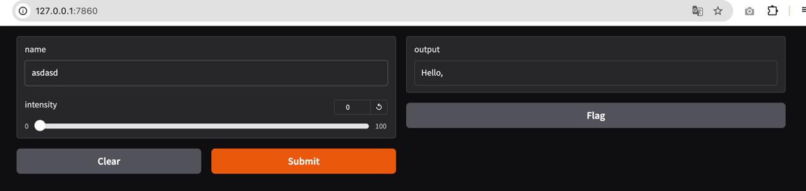
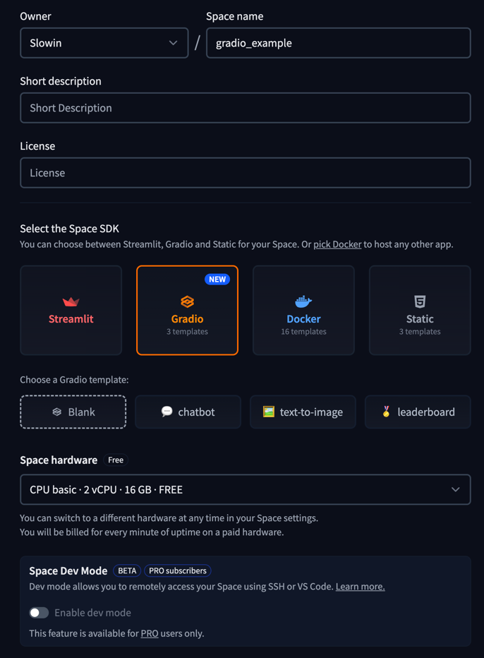
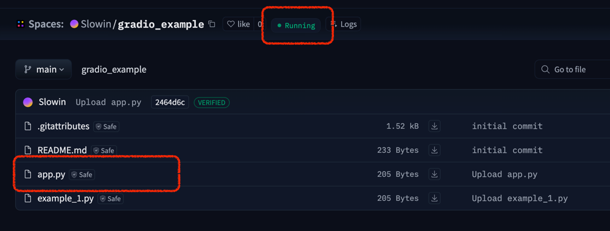
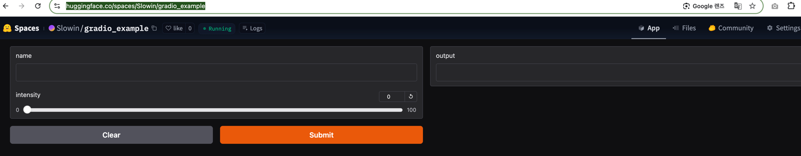

# gradio란?

## 링크
https://www.gradio.app/

## 예제

### 1. 설치

- [docs](https://www.gradio.app/docs)

#### 설치 커맨드
```bash
pip install --upgrade gradio
```

---

### 2. 사용 예시

#### example_1.py 

```python

import gradio as gr

def greet(name, intensity):
    return "Hello, " + name + "!" * int(intensity)

demo = gr.Interface(
    fn=greet,
    inputs=["text", "slider"],
    outputs=["text"],
)

demo.launch()
```

#### 실행 
```bash
python example_1.py
```

#### 실행 이미지


---

### 2.1 허깅페이스 배포 가능

`app.py` 를 업로드하면 허깅페이스에서 web app 으로 배포 가능

> space 생성 : https://huggingface.co/new-space




---

> [spaces/Slowin/gradio_example 링크](https://huggingface.co/spaces/Slowin/gradio_example)



