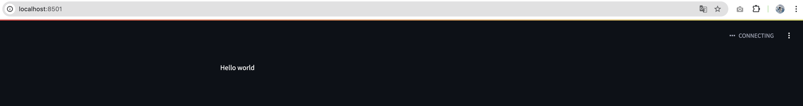
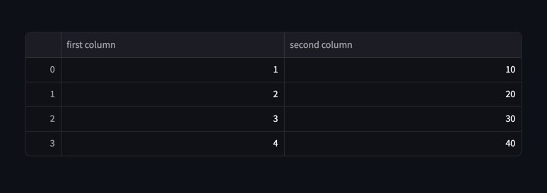
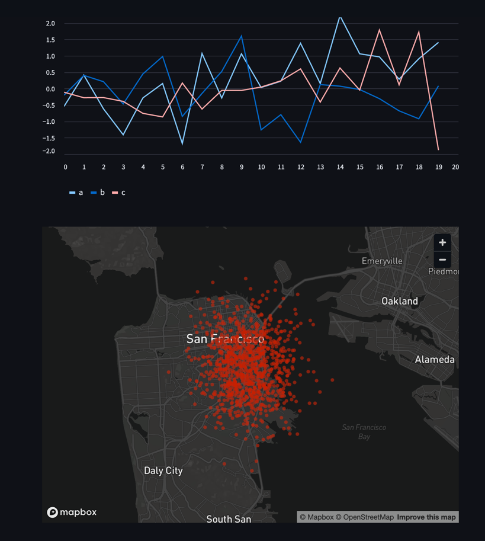
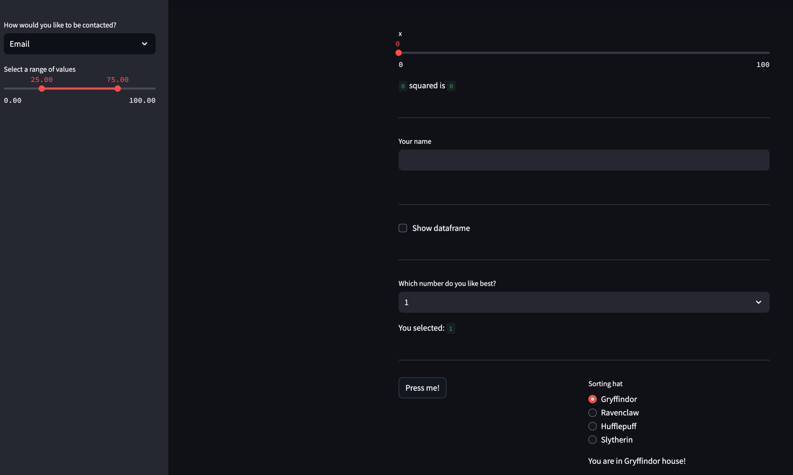
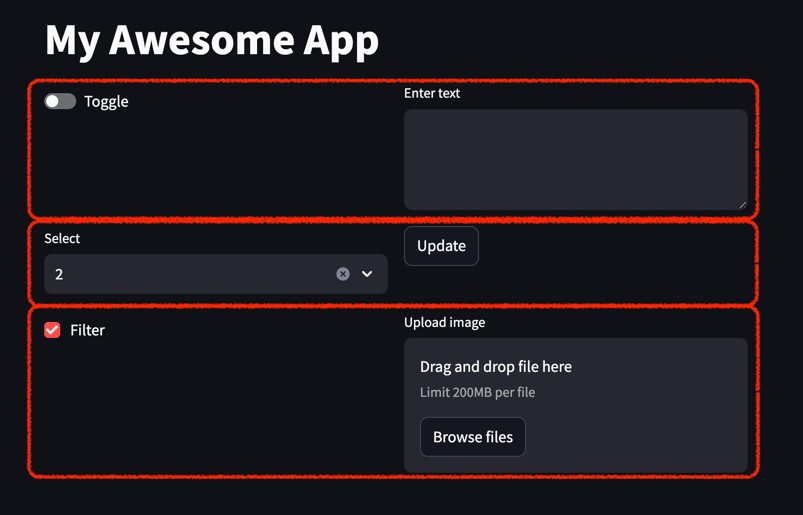
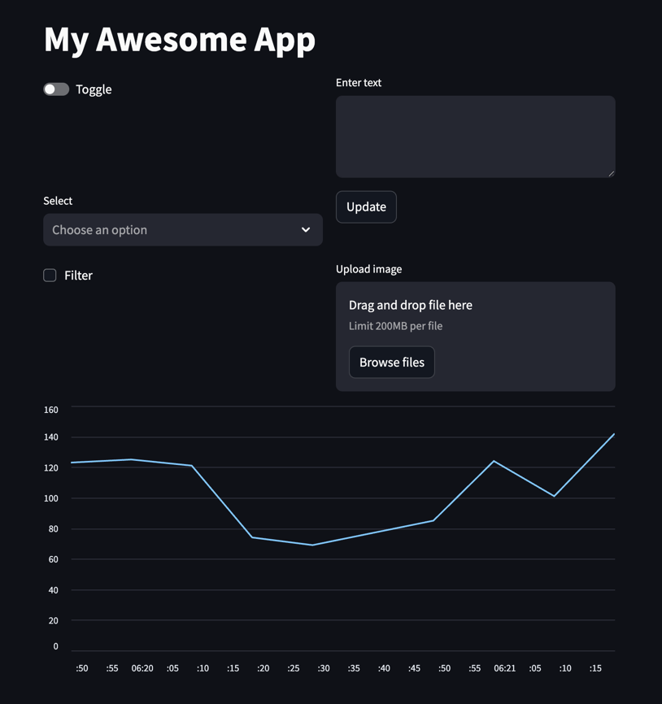

## Streamlit이란

Streamlit은 Python 기반의 데이터 애플리케이션을 간단하게 만들 수 있는 라이브러리


### 1. 설치 가이드

- [docs](https://docs.streamlit.io/get-started/installation)
```bash
pip install streamlit

streamlit hello
```

### 2. 사용 예시

```python
# example_1.py

import streamlit as st

st.write("Hello world")
```

- 실행 커맨드

```bash
streamlit run example_1.py
```



### 3. 다양한 표현 

#### 3.1 Display and style data

#### 실행 커맨드
```bash
streamlit run example_2.py
```

#### 예시 코드 
```python
# example_2.py

import streamlit as st
import pandas as pd
df = pd.DataFrame({
  'first column': [1, 2, 3, 4],
  'second column': [10, 20, 30, 40]
})

df
```

#### 실행 이미지




#### 3.2 Draw charts and maps

#### 실행 커맨드
```bash
streamlit run example_3.py
```

#### 예시 코드 
```python
# example_3.py

import streamlit as st
import numpy as np
import pandas as pd

# chart
chart_data = pd.DataFrame(
     np.random.randn(20, 3),
     columns=['a', 'b', 'c'])

st.line_chart(chart_data)

# map
map_data = pd.DataFrame(
    np.random.randn(1000, 2) / [50, 50] + [37.76, -122.4],
    columns=['lat', 'lon'])

st.map(map_data)
```

#### 실행 이미지


#### 3.3 Add interactivity with widgets

```bash
streamlit run example_4.py
```

```python
# example_4.py

import streamlit as st
import numpy as np
import pandas as pd
import time

x = st.slider('x')  # 👈 this is a widget
st.write(x, 'squared is', x * x)

st.write("---")

st.text_input("Your name", key="name")

st.session_state.name

st.write("---")

# Use checkboxes to show/hide data

if st.checkbox('Show dataframe'):
    chart_data = pd.DataFrame(
       np.random.randn(20, 3),
       columns=['a', 'b', 'c'])

    chart_data

st.write("---")

# Use a selectbox for options
df = pd.DataFrame({
    'first column': [1, 2, 3, 4],
    'second column': [10, 20, 30, 40]
    })

option = st.selectbox(
    'Which number do you like best?',
     df['first column'])

'You selected: ', option

# Layout

st.write("---")

# Add a selectbox to the sidebar:
add_selectbox = st.sidebar.selectbox(
    'How would you like to be contacted?',
    ('Email', 'Home phone', 'Mobile phone')
)

# Add a slider to the sidebar:
add_slider = st.sidebar.slider(
    'Select a range of values',
    0.0, 100.0, (25.0, 75.0)
)

# Layout
left_column, right_column = st.columns(2)
# You can use a column just like st.sidebar:
left_column.button('Press me!')

# Or even better, call Streamlit functions inside a "with" block:
with right_column:
    chosen = st.radio(
        'Sorting hat',
        ("Gryffindor", "Ravenclaw", "Hufflepuff", "Slytherin"))
    st.write(f"You are in {chosen} house!")

st.write("---")

# Show progress


'Starting a long computation...'

# Add a placeholder
latest_iteration = st.empty()
bar = st.progress(0)

for i in range(100):
  # Update the progress bar with each iteration.
  latest_iteration.text(f'Iteration {i+1}')
  bar.progress(i + 1)
  time.sleep(0.1)

'...and now we\'re done!'

st.write("---")

```


#### 3.4 Page layout

```bash
streamlit run page_example/page_app.py
```

```python

# page_example/page_app
import streamlit as st

# Define the pages
main_page = st.Page("main_page.py", title="Main Page", icon="🎈")
page_2 = st.Page("page_2.py", title="Page 2", icon="❄️")
page_3 = st.Page("page_3.py", title="Page 3", icon="🎉")

# Set up navigation
pg = st.navigation([main_page, page_2, page_3])

# Run the selected page
pg.run()
```


#### 3.6 Fragment

```python
import streamlit as st

# Define the pages
main_page = st.Page("main_page.py", title="Main Page", icon="🎈")
page_2 = st.Page("page_2.py", title="Page 2", icon="❄️")
page_3 = st.Page("page_3.py", title="Page 3", icon="🎉")

# Set up navigation
pg = st.navigation([main_page, page_2, page_3])

# Run the selected page
pg.run()

```



#### 3.7 Automate fragment reruns

#### 실행 커맨드
```bash
streamlit run example_5.py
```

#### 예시 코드

```python
# example_5.py

def get_latest_updates():
    # 현재 시간을 기준으로 10개의 데이터 생성
    timestamps = [datetime.datetime.now() - datetime.timedelta(seconds=i * 10) for i in range(10)]
    values = np.random.randint(50, 150, size=10)  # 50~150 사이의 임의 값

    # 데이터 프레임 생성
    df = pd.DataFrame({"timestamp": timestamps, "value": values})

    # 시간 순 정렬
    df = df.sort_values("timestamp")

    return df


@st.fragment(run_every="3s")
def auto_function():
    df = get_latest_updates()
    st.line_chart(df.set_index("timestamp"))

auto_function()
```

#### 실행 이미지

